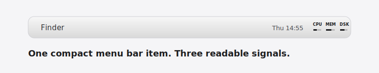
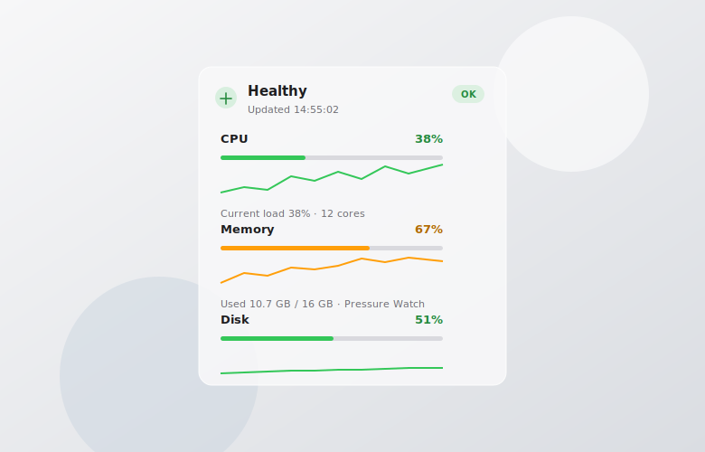

# UsageBar

[English README](README.md)

UsageBar 是一个轻量的 macOS 原生菜单栏监控工具，用来显示 CPU、内存和磁盘使用状态。它默认保持克制：菜单栏只显示三组小文字和横向用量条，点击后才显示具体百分比、已用、剩余和总量。



## 主要特性

- 使用 Swift、SwiftUI 和 AppKit 构建的 macOS 原生菜单栏应用。
- 一个紧凑的菜单栏状态项，同时显示 CPU、内存和磁盘。
- 点击菜单栏后显示具体用量、剩余量和总量。
- 弹出面板包含 60 秒 mini history sparkline。
- 自动根据系统语言显示英文或中文。
- 只在本地采样系统状态，不需要账号，不上传数据。



## 下载

从 [GitHub Releases](https://github.com/MightyKartz/usage/releases/latest) 下载最新 macOS 构建。

发布构建已使用 Developer ID 签名，但暂未做 Apple notarization 公证。如果 macOS 首次启动时拦截，可以右键点击应用并选择 **打开**，或者从源码自行构建。

## 从源码构建

要求：

- macOS 14 或更高版本
- Xcode Command Line Tools
- Swift 5.9 或更高版本

本地运行：

```bash
swift test
./script/build_and_run.sh
```

如果本机有 Developer ID 证书，可以构建签名版：

```bash
VERSION=0.1.0 CODESIGN_IDENTITY="Developer ID Application: Your Name (TEAMID)" ./script/build_and_run.sh --verify
```

应用会生成在 `dist/UsageBar.app`。

## 项目说明

UsageBar 面向只想快速判断系统状态、但不想频繁打开活动监视器的用户。菜单栏显示尽量贴近 macOS 原生比例，弹出面板则在需要时提供更完整的 CPU、内存和磁盘细节。

## 隐私

UsageBar 只读取本机系统统计信息，不会把数据发送到任何地方。
