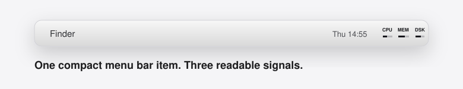
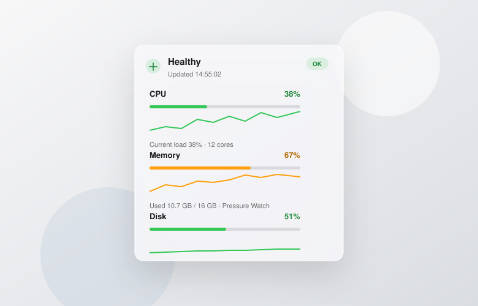

# CoreBar

[English README](README.md)

CoreBar 是一个安静的 macOS 菜单栏用量监控工具，用来查看 CPU、内存、磁盘和网络状态。它在菜单栏里保持紧凑，适合长期放在后台运行，点击后再显示具体数字。



## 显示内容

- 在一个原生菜单栏项目里显示 CPU、内存和磁盘用量。
- 小字标签搭配细横条，自动适配浅色和深色模式。
- 在详情面板显示当前下载和上传速度。
- 提供经典列表与卡片面板，设置页可以直接返回用量概览。
- 浅色面板使用不透明背景，深色保留系统玻璃效果；两种外观的设置页均使用中性色原生控件。
- 设置页支持登录时启动、刷新间隔、显示指标、面板风格和阈值颜色。
- 卡片概览随显示指标数量调整高度。整体健康状态包含隐藏的 CPU、内存压力和磁盘指标，并明确标注未显示的告警来源。
- 容量信息完整呈现，网络速率标明收发合计；趋势图说明最近 30 次采样及网络自动缩放规则。
- 点击后打开磨砂玻璃风格面板，显示已用、剩余和总量。
- CPU 和网络显示最近 30 次定时采样的趋势，内存和磁盘显示进度条。
- 自动根据系统语言显示中文或英文。
- 只读取本机系统状态，不需要账号，不做追踪，不连接云服务。



内存百分比表示根据系统页面统计计算的压力估算，并非活动监视器的压力信号；“已用”容量单独展示，不对应这个百分比。网络速率按启用的非回环接口统计，包含虚拟接口。趋势图的时间跨度随刷新间隔变化。

## 为什么做 CoreBar

CoreBar 面向只想快速判断系统状态、但不想频繁打开活动监视器的用户。它足够轻，可以一直留在菜单栏；需要细节时，再点开查看。

## 下载

从 [GitHub Releases](https://github.com/MightyKartz/CoreBar/releases/latest) 下载最新 macOS 构建。

发布构建已使用 Developer ID 签名，但暂未做 Apple notarization 公证。如果 macOS 首次启动时拦截，可以右键点击应用并选择 **打开**，或者从源码自行构建。

## 从源码构建

要求：

- 应用可运行于 macOS 14 或更高版本。
- 构建需要 Xcode 26 或更高版本、macOS 26 SDK 及其附带的 Swift 工具链，并通过 `xcode-select` 选中。旧版独立 Command Line Tools 不包含所需的 Liquid Glass API。
- 目前已在 Xcode 26.6 上验证开发构建。

本地运行：

```bash
swift test
./script/build_and_run.sh
```

脚本构建 Xcode 中的应用 target，包含图标、Info.plist 和沙盒权限。默认使用 Debug 配置及 ad hoc 本地签名；SwiftPM 继续用于快速运行单元测试。

只构建，不停止或启动应用：

```bash
./script/build_and_run.sh --build-only
```

如果本机有 Developer ID 证书，可以构建 Release 签名版：

```bash
CONFIGURATION=Release DEVELOPMENT_TEAM="TEAMID" CODESIGN_IDENTITY="Developer ID Application: Your Name (TEAMID)" ./script/build_and_run.sh --build-only
```

应用会生成在 `dist/CoreBar.app`。版本号和构建号以 Xcode 工程为准，也可通过 `VERSION` 和 `BUILD_NUMBER` 覆盖。`DIST_DIR` 和 `DERIVED_DATA_DIR` 可分别指定产物目录和构建缓存目录；相对路径以仓库根目录为基准，脚本可从任意工作目录调用。

所有构建均沿用工程中的沙盒权限。Developer ID 构建使用 Hardened Runtime 并请求签名时间戳；脚本不会提交 Apple notarization 公证。

默认运行流程会先完成构建和签名验证，再替换并重启应用。`--debug`、`--logs`、`--telemetry` 和 `--verify` 分别保留调试器、日志流和启动检查用途。

## 隐私

CoreBar 只读取本机系统统计信息，不会把数据发送到任何地方。
